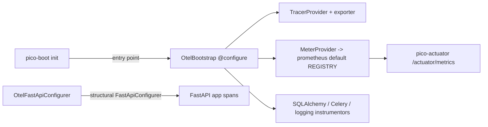

# Architecture

| Module | Responsibility |
|---|---|
| `bootstrap.py` | Idempotent SDK setup + instrumentors + FastAPI configurer |
| `config.py` | `OtelSettings` (prefix `otel`) |

## Design decisions

**The default Prometheus registry is the contract with pico-actuator.**
pico-otel writes (`PrometheusMetricReader`), pico-actuator reads
(`/actuator/metrics`). Neither imports the other; installing both composes
with zero config. Refactors on either side must preserve this.

**Structural typing instead of importing pico-fastapi.**
`OtelFastApiConfigurer` satisfies the `FastApiConfigurer` protocol by shape
(`priority`, `configure_app`). With pico-fastapi absent the component simply
never runs — no optional import, no extra.

**Idempotent, first-configuration-wins.** OTel global providers are
process-level; a second container must not fight the first. Setup checks for
the SDK provider and skips — deterministic in test suites that boot many
containers.

**Every instrumentation is import-guarded and mapped 1:1 to an extra.** The
base install carries only the SDK; you pay (in dependencies) exactly for
what you instrument. Missing extra = silent skip with an INFO log.

**`auto` exporter mode.** OTLP when an `endpoint` is configured, console
otherwise — the dev-to-prod transition is one yaml line.
